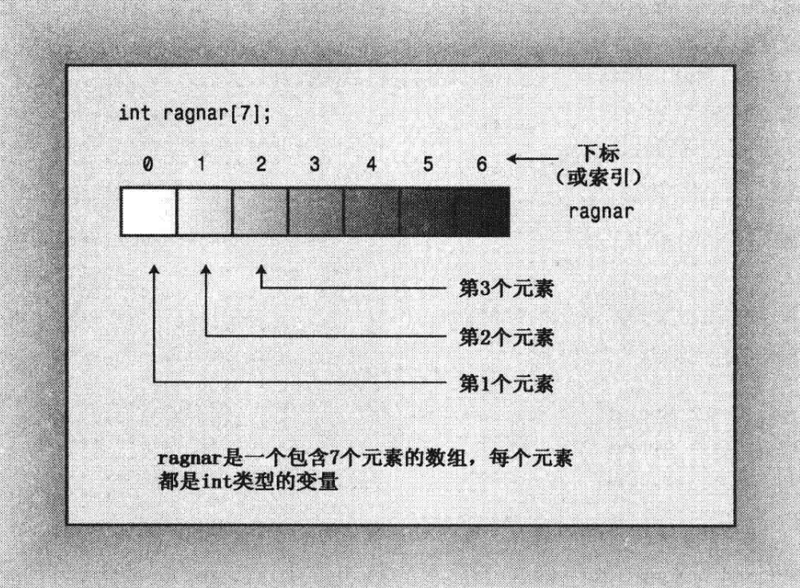

# 数组

数组是一种数据结构，可以存储多个同类型的值。每个值都存储在一个独立的数组元素中，计算机在内存中依次存储数组的各个元素。

数组的声明需要指出元素的类型、数组名和数组中的元素数。

例如，`int ragnar[7];`声明了一个名为`ragnar`的数组，该数组有7个元素，每个元素都可以存储一个`int`类型的值。




数组被称为复合类型，因为它是使用其他类型创建的。

数组必须是特定类型的，例如`char`数组或`long`数组。

数组的类型是由其元素的类型决定的，例如`float loans[20];`声明的`loans`的类型是“float数组”。


数组元素通过索引进行访问，C++数组的索引从0开始。

例如，`months[0]`是`months`数组的第一个元素，`months[11]`是最后一个元素。


编译器不会检查使用的下标是否有效，如果赋值给不存在的元素，可能会引发问题，如破坏数据或代码，或导致程序异常终止。


## 1. 常规初始化

只有在定义数组时才能使用初始化，此后就不能使用了，也不能将一个数组赋给另一个数组，但可以使用下标分别给数组中的元素赋值。

```C++
int cards[4] = {3，6，8，10};// okay
int hand[4];// okay
hand[4] = {5，6，7，9};// not allowed
hand = cards;// not allowed
```


初始化数组时，提供的值可以少于数组的元素数目。

如果只对数组的一部分进行初始化，则编译器将把其他元素设置为0。

```C++
float hotelTips[5] = {5.0,2.5};
```


只要显式地将第一个元素初始化为0，编译器会将其他元素都初始化为0。

```C++
long totals[500]={0};
```


如果初始化为{1}而不是{0}，则第一个元素被设置为1，其他元素都被设置为0。

```C++
long totals[500]={1};
```


如果初始化数组时方括号内(`[]`)为空，C++编译器将计算元素个数。

例如，对于下面的声明，编译器将使`things` 数组包含4个元素：

```C++
short things[]=(1，5，3，8);
```


通常，让编译器计算元素个数是种很糟的做法，因为其计数可能与您想象的不一样。

例如，您可能不小心在列表中遗漏了一个值。


这种方法对于将字符数组初始化为一个字符串来说比较安全。

如果主要关心的问题是程序，而不是自己是否知道数组的大小，则可以这样做：

```c++
short things[]=(1，5，3，8); 
int num_elements=sizeof things/sizeof(short);
```


## 2. 列表初始化

首先，初始化数组时，可省略等号(=):

```C++
double earnings[4]{1.2e4,1.6e4,1.1e4,1.7e4};
```


其次，可不在大括号内包含任何东西，这将把所有元素都设置为零

```c++
unsigned int counts[10]={};//all elements set to 0
float balances[100]{};//all elements set to 0
```


第三，列表初始化禁止缩窄转换

```c++
long plifs[]={25,92,3.0};			//not allowed
char slifs[4]{'h','i',1122011,\0'};	//not allowed
char tlifs[4]{'h','i',112,0'};		//allowed
```

1. 因为将浮点数转换为整型是缩窄操作，即使浮点数的小数点后面为零。
2. 因为1122011超出了char变量的取值范围(这里假设char 变量的长度为8位)。
3. 语句可通过编译，因为虽然112是一个int值，但它在char 变量的取值范围内。

