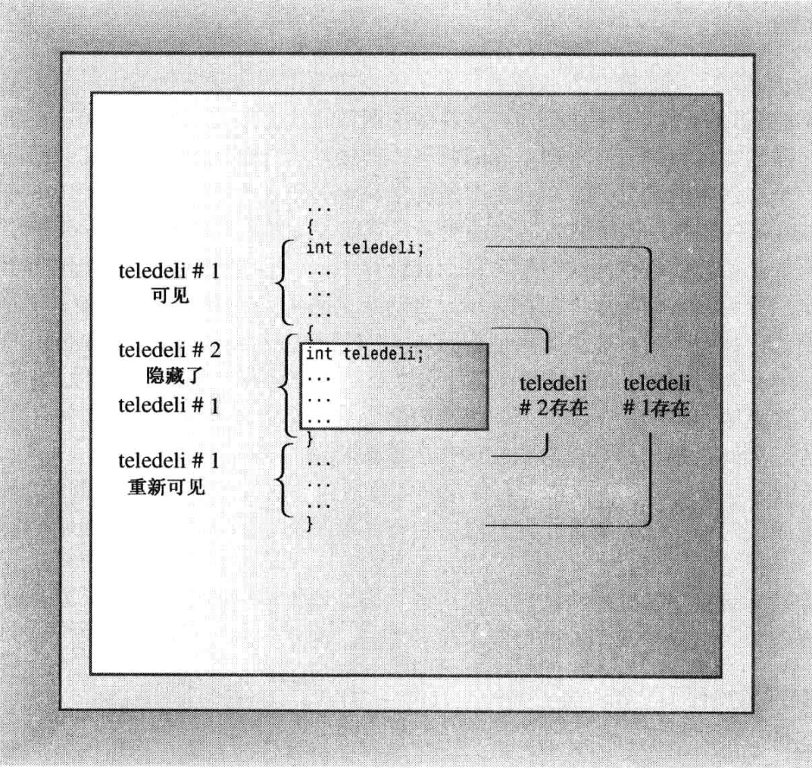

# 存储持续性、作用域和链接性

1. **自动存储持续性**：在函数定义中声明的变量（包括函数参数）的存储持续性为自动的。它们在程序开始执行其所属的函数或代码块时被创建，在执行完函数或代码块时，它们使用的内存被释放。C++有两种存储持续性为自动的变量。
2. **静态存储持续性**：在函数定义外定义的变量和使用关键字`static`定义的变量的存储持续性都为静态。它们在程序整个运行过程中都存在。C++有3种存储持续性为静态的变量。
3. **线程存储持续性**（C++11）：当前，多核处理器很常见，这些CPU可同时处理多个执行任务。这让程序能够将计算放在可并行处理的不同线程中。如果变量是使用关键字`thread local`声明的，则其生命周期与所属的线程一样长。
4. **动态存储持续性**：用`new`运算符分配的内存将一直存在，直到使用`delete`运算符将其释放或程序结束为止。这种内存的存储持续性为动态，有时被称为自由存储(feestore)或堆(heap)。


## 1. 作用域和链接

1. **作用域（Scope）**：描述了名称在文件（翻译单元）的多大范围内可见。C++变量的作用域有多种，包括局部作用域、全局作用域、函数原型作用域、类作用域和名称空间作用域。
2. **链接性（Linkage）**：描述了名称如何在不同单元间共享。链接性为外部的名称可在文件间共享，链接性为内部的名称只能由一个文件中的函数共享。自动变量的名称没有链接性，因为它们不能共享。
3. **存储持续性**：不同的C++存储方式是通过存储持续性、作用域和链接性来描述的。存储持续性描述了变量在内存中的生命周期。

以下是这些概念的详细解释：

- **局部作用域**：作用域为局部的变量只在定义它的代码块中可用。代码块是由花括号括起的一系列语句。例如函数体就是代码块，但可以在函数体中嵌入其他代码块。
- **全局作用域**：作用域为全局（也叫文件作用域）的变量在定义位置到文件结尾之间都可用。自动变量的作用域为局部，静态变量的作用域是全局还是局部取决于它是如何被定义的。
- **函数原型作用域**：在函数原型作用域（function prototype scope）中使用的名称只在包含参数列表的括号内可用。
- **类作用域**：在类中声明的成员的作用域为整个类。
- **名称空间作用域**：在名称空间中声明的变量的作用域为整个名称空间。由于名称空间已经引入到C++语言中，因此全局作用域是名称空间作用域的特例。
- **C++函数的作用域**：C++函数的作用域可以是整个类或整个名称空间（包括全局的），但不能是局部的。


## 2. 自动存储持续性

**默认情况**，函数中声明的函数参数和变量的**存储持续性为自动**，**作用域为局部，没有链接性**。

只有在定义它们的函数中才能使用它们，两个函数之间的**局部变量不会互相影响**。

开始执行这些变量所属的代码块时，将为其分配内存，结束时，这些变量都将消失。

注意：执行到代码块时，将为变量分配内存，但其作用域的起点为其声明位置）。


例如：假设在main()的开头定义了一个名为 teledeli 的变量，然后在 main( )中开始一个新的代码块，并其中定义了一个新的变量 websight，则 teledeli 在内部代码块和外部代码块中都是可见的，而 websight 就只在内部代码块中可见，它的作用域是从定义它的位置到该代码块的结尾：

```cpp
int main(){
    int teledeli=5;
    {
        // websight allocated
        cout << "Hello\n";
        // websight scope begins
        int websight=-2;
        cout << teledeli << endl;
        cout << websight << endl;
        // websight expires
    }
    // teledeli expires
}
```


如果有两个同名的变量(一个位于外部代码块中，另一个位于内部代码块中)，新的定义隐藏了(hide)以前的定义（变量），新定义可见，旧定义暂时不可见。在程序离开该代码块时，原来的定义又重新可见。




## 3. 静态持续变量

### 3.1 定义

1. 静态变量的数目在程序运行期间是不变的，因此程序不需要使用特殊的装置(如栈)来管理它们。

2. 编译器将分配固定的内存块来存储所有的静态变量，这些变量在整个程序执行期间一直存在。
3. 如果没有显式地初始化静态变量，默认情况下，静态数组和结构将每个元素或成员的所有位都设置为0。


持续性变量提供了3种链接性：

- 外部链接性(可在其他文件中访问)
- 内部链接性(只能在当前文件中访问)
- 无链接性(只能在当前函数或代码块中访问)


下面介绍如何创建这3种静态持续变量，然后介绍它们的特点：

创建**链接性为外部**的静态持续变量，必须在**代码块的外面**声明它；

创建**链接性为内部**的静态持续变量，必须在**代码块的外面**声明它，并使用 static 限定符；

要创建**没有链接性**的静态持续变量，必须在**代码块内**声明它，并使用static 限定符。

```cpp
int global = 1000; // 静态持续性，外部链接性
static int one_file = 50; // 静态持续性，内部链接性

int main() {
    // ...
}

void funct1(int n) {
    static int count = 0; // 静态持续性，无链接性
    int llama = 0; // 自动变量
    // ...
}

void funct2(int q) {
    // ...
}

```

- global的**链接性为外部**，因此可以在程序的其他文件中使用它；
- one_file的**链接性为内部**，因此只能在包含上述代码的文件中使用它；
- count的**作用域为局部**，**没有链接性**，只能在funct1()函数中使用它。

- 即使在funct1()函数没有被执行时，count也留在内存中。
- global和one_file从声明位置到文件结尾的范围内都可以被使用。


下表总结了引入名称空间之前使用的存储特性和静态持续性：


### 3.2 初始化

首先，所有静态变量都会被零初始化，无论程序员是否显式地初始化它们。

接下来，如果变量是用常量表达式初始化的，并且编译器仅根据文件内容（包括被包含的头文件）就能计算出表达式，那么编译器将执行常量表达式初始化。

必要时，编译器将执行简单计算。如果没有足够的信息，变量将被动态初始化。

请看下面的代码：

```cpp
#include <cmath>
int x; // 零初始化
int y = 5; // 常量表达式初始化
long z = 13 * 13; // 常量表达式初始化
const double pi = 4.0 * atan(1.0); // 动态初始化
```

首先，`x`、`y`、`z` 和 `pi` 被零初始化。然后，编译器计算常量表达式，并将 `y` 和 `z` 分别初始化为 `5` 和 `169`。但要初始化 `pi`，必须调用函数 `atan`，这需要等到该函数被链接且程序执行时。


常量表达式并非只能是使用字面常量的算术表达式。例如，它还可以使用 `sizeof` 运算符：

```cpp
int enough = 2 * sizeof(long) + 1; // 常量表达式初始化
```


## 4. 持续性和链接性


### 4.1 静态持续性、外部链接性

C++中的外部变量（也称全局变量）和单定义规则：

1. **外部变量**：变量在函数外部定义，因此对所有函数而言都是外部的。它们的存储持续性为静态，作用域为整个文件。

    例如，可以在 main()前面或头文件中定义它们。

    可以在文件中位于外部变量定义后面的任何函数中使用它，因此外部变量也称全局变量。

2. **单定义规则**：C++有“单定义规则”(One Definition Rule，ODR)，该规则指出，变量只能有一次定义。为满足这种需求，C++提供了两种变量声明。

    - **定义声明**：也称为定义，它给变量分配存储空间。例如，`double up;`就是一个定义声明，它为变量`up`分配了存储空间。
    - **引用声明**：也称为声明，它不给变量分配存储空间，因为它引用已有的变量。引用声明使用关键字 `extern`，且不进行初始化。例如，`extern int blem;`就是一个引用声明，它引用了在其他地方定义的变量`blem`。


假设我们有两个文件，`file1.cpp` 和 `file2.cpp`。

在 `file1.cpp` 中，我们定义了一个外部变量 `int globalVar = 10;`。这个变量可以在 `file1.cpp` 的任何地方使用。

```cpp
// file1.cpp
#include <iostream>

int globalVar = 10; // 定义全局变量

void display() {
    std::cout << "Global variable in file1: " << globalVar << std::endl;
}
```


现在，如果我们想在 `file2.cpp` 中使用这个全局变量，我们需要使用 `extern` 关键字来声明它。这样，我们就可以在 `file2.cpp` 中访问 `globalVar`。

```cpp
// file2.cpp
#include <iostream>

extern int globalVar; // 声明全局变量

void display() {
    std::cout << "Global variable in file2: " << globalVar << std::endl;
}
```


### 4.2 静态持续性、内部链接性

将static限定符用于作用域为整个文件的变量时，该变量的链接性将为内部的。

- 链接性为内部的变量只能在其所属的文件中使用；
- 但常规外部变量都具有外部链接性，即可以在其他文件中使用。


如果文件定义了一个静态外部变量，其名称与另一个文件中声明的常规外部变量相同，则在该文件静态变量将隐藏常规外部变量：‘

```cpp
// file1
int errors = 20;
// external declaration

// file2
static int errors = 5; // known to file2 only
void froobish() {
    // uses errors defined in file2
    // Cout << errors;
}

```


### 4.3 静态存储持续性、无链接性

无链接性的局部变量：这种变量是这样创建的，将 statc 限定符用于在代码块中定义的变量，将导致局部变量的存储持续性为静态的。

这意味着虽然该变量只在该代码块中可用，但它在该代码块不处于活动状态时仍然存在。

因此在两次函数调用之间,静态局部变量的值将保持不变。


```cpp
#include <stdio.h>

void func() {
    static int x = 0; // 这是一个静态局部变量，只会初始化一次，在程序启动时
    x++;
    printf("x = %d\n", x);
}

int main() {
    func(); // 第一次调用
    func(); // 第二次调用
    return 0;
}
```

`func`函数中的`x`是一个静态局部变量。虽然它只在`func`函数中定义和可见，但是它的值在函数调用之间是持久的。

在第一次调用，x变量自增1，并保留，所以，当你第二次调用`func`函数时，`x`的值将是1，而不是0。

这是因为`x`在上一次`func`函数调用结束时并没有被销毁，而是保留了它的值。


# 扩展

## 1. auto

在C语言和早期的C++版本中，`auto`关键字用于显式地指出变量为自动存储，也就是说，这些变量在函数调用时创建，在函数结束时销毁。例如：

```cpp
int froob(int n)
{
    auto float ford; //ford has automatic storage
}
```


在C++11中，`auto`关键字的用法发生了变化，它现在用于自动类型推断。这意味着编译器会根据变量的初始值自动推断出它的类型。例如：

```cpp
auto i = 42; // i is an int
auto s = "hello"; // s is a const char*
```


## 2. register

在C语言中和C++11之前，它建议编译器使用CPU寄存器来存储自动变量：

```c
register int count; // request for a register variable
```

在C++11中，无需register指示，编译器在一定情况下会自动auto使用CPU寄存器来存储自动变量，现在register与以前的auto用途完全相同，指出程序员想使用一个自动变量。

## 3. 说明符和限定符

1. **const**：`const`关键字用于声明常量，这意味着一旦一个变量被声明为`const`，它的值就不能被改变。如果你试图改变一个`const`变量的值，编译器会报错。例如：

```c++
const int x = 10; // 声明一个const整数x，并初始化为10
x = 20; // 错误！不能改变const变量的值
```


2. **volatile**：`volatile`关键字用于告诉编译器，变量的值可能会在外部被改变，因此编译器不应该对这个变量进行优化。这在处理硬件寄存器或者某些特殊类型的变量时非常有用。

3. **mutable**：`mutable`关键字只能用于类的非静态数据成员。即使在一个`const`方法中，`mutable`成员也可以被修改。这在你想修改一个对象的某些特定属性，但又不想改变对象的整体`const`性质时非常有用。例如：

```c++
class MyClass {
public:
    MyClass() : x(0) {}
    void increment() const {
        x++; // 这是合法的，因为x是mutable的   即使外部定义对象时是const MyClass test;
    }
private:
    mutable int x;
};
```


4. **const**用于全局变量：如果对全局变量使用了`const`，则这个变量只能在当前文件范围内使用，就像被`const`了一样。如果出于某种原因，程序员希望某个常量的链接性为外部的，则可以使用 `extern` 关键字来覆盖默认的内部链接性。例如：

```c++
// 具有外部链接性的定义
extern const int states = 50;
```


## 4.语言链接性

在C语言中，一个名称只对应一个函数，因此很容易实现。

例如，C语言编译器可能将 spi 这样的函数名翻译为 _spi，这种方法被称为C语言链接性。

在C++中，同一个名称可能对应多个函数，因此必须将这些函数翻译为不同的符号名称。C++编译器执行名称矫正或名称修饰，为重载函数生成不同的符号名称。

例如，可能将 spif(int) 转换为 _spof_i，而将 spiff(double, double) 转换为 _spif_d_d。这种方法被称为C++语言链接性。

当链接程序寻找与C++函数调用匹配的函数时，使用的方法与C语言不同。

如果要在C++程序中使用C库中预编译的函数，就需要考虑如何处理。


例如，假设有下面的代码：`spiff(22);`，它在C库文件中的符号名称为 _spi，但对于我们假设的链接程序来说，C++查询约定是查找符号名称 _spiff_i。

为解决这种问题，可以用函数原型来指出要使用的约定：

```cpp
extern "C" void spiff(int); // 使用C协议进行名称查找
extern void spoff(int); // 使用C++协议进行名称查找
extern "C++" void spaff(int); // 使用C++协议进行名称查找
```

第一个原型使用C语言链接性，而后面的两个使用C++语言链接性。

第二个原型是通过默认方式指出这点的，而第三个显式地指出了这一点。

C和C++链接性是C++标准指定的说明符，但实现可提供其他语言链接性说明符。这意味着除了C和C++之外，还可能有其他的链接性说明符。


