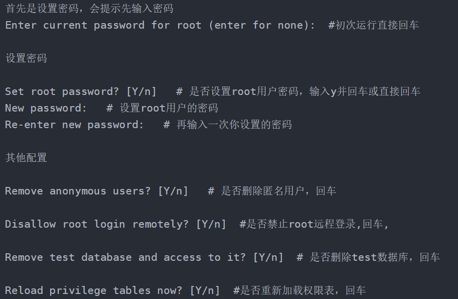

# Mariadb部署

## 软件安装

```
#mariadb是mysql的分支，100%兼容mysql语句
#mariadb的软件包是mariadb-server
#查看是否安装mariadb软件包
rpm -qa | grep mariadb
#rpm -qa 输出所有已安装的软件包，使用管道符('|')把输出结果传给grep命令进行过滤，只保留含mariadb的结果
dnf -y install mariadb-server
#安装好后，启动mariadb查看是否能够正常运行
systemctl start mariadb  #启动mariadb数据库
systemctl enable mariadb  #将mariadb添加到开机自启
```


## 初始化

```
#使用命令初始化mariadb数据库，并配置密码和相关权限
mysql_secure_installation  #初始化mariadb数据库
```




# 重置root密码

## 编辑配置文件

配置文件一般在/etc/my.cnf文件，或/etc/my.cnf.d/目录下面的文件

找到这样的格式，我的在/etc/my.cnf.d/mariadb-server.cnf文件里面

在后面新增skip-grant-tables

```
[mysqld]
datadir=/var/lib/mysql
socket=/var/lib/mysql/mysql.sock
log-error=/var/log/mariadb/mariadb.log
pid-file=/run/mariadb/mariadb.pid
skip-grant-tables   #这句话是我刚刚手动添加进去的，默认看不到，需要手动添加
```


## 刷新权限表

重启数据库后在bash中输入mysql（无需指定用户和密码）即可进入数据库。

如果不刷新权限表，直接使用sql语法进行管理，则可能出现报错。

```
ERROR 1290 (HY000): The MySQL server is running with the --skip-grant-tables option so it cannot execute this statement
#错误1290（HY000）：MySQL服务器运行时带有--skip-grant-tables选项，因此无法执行此语句
```

刷新权限表后可以正常sql语法

```
FLUSH PRIVILEGES;
```


## update重置密码

```
update mysql.user set authentication_string = password('123456') where User = 'root' and Host = 'localhost';

#mysql数据库的用户的密码和权限保存在，mysql数据库中的user表中。

#update mysql.user set authentication_string = password('123456')
#将mysql数据库中authentication_string字段中所有数据改为123456密码的哈希值
#mysql数据库用户密码是以非明文方式存在的，所以要使用password()计算出123456的哈希值

#where User = 'root' and Host = 'localhost';
#如果不加这句话，会把所有用户的密码改成123456，所以要使用语句筛选出User为root且Host为localhost的用户
#仅将筛选出来的用户密码设置为123456
```


重置密码后需要再次刷新权限表

```
flush privileges;
```


退出数据库登录

```
exit;
```


编辑文件，删除最开始设置的 `skip-grant-tables`

重启数据库，就可以使用新密码，登录数据库了

```
systemctl restart mariadb
```


# 用户管理

## 登录数据库

登录mariadb数据库，因为mariadb是100%兼容MySQL的，所以可以使用mysql的语句登录数据库

```
mysql -u root -p123456

#mysql -u [用户名] —p[密码]
#-p和密码之间不用空格 也不允许存在空格
```


## 创建用户

```
create user 用户名@IP地址 identified by '密码';
```


## 删除用户

```
drop user User@localhost;
```


## 设置权限

```
grant 权限 on 数据库.数据表 to 用户名@登录主机 identified by "密码";

权限详见表单，多个权限之间用逗号分隔

数据库.数据表，代表用户对 "指定数据库" 中的 "指定数据表" 表有该权限。
mysql.user  权限用于"mysql数据库"中的"user数据表"
mysql.*     权限用于"mysql数据库"中的"所有数据表"
*.*            权限用于"所有数据库"中的"所有数据表"
```


## 删除权限

```
revoke all on *.* from xiaoshae@localhost;

#revoke 权限 on *.* from User@Host;
```


## 刷新权限表

```
flush privileges;
```


## 示例

给root账号新增一个密码，远程登录root账号必须使用该密码


### 创建root账户

```
create user 'root'@'%' identified by '123456qw';  

#创建一个root账号，密码设置为123456qw，Host设置为'%'，表示允许任何主机登录
#mysql数据库，user和Host可以重复存在，只要两者不同时重复就可以

#例如，已存在用户root@localhost。
#可以创建一个User为root，Host不为localhost的用户
#或者创建一个User不为root，Host为localhost的用户
```


### 赋予新root权限

```
grant all on *.* to 'root'@'%' identified by '123456qw';
```


### 登录新root账户

错误示例

```
mysql -u root -p123456qw;

#ERROR 1045 (28000): Access denied for user 'root'@'localhost' (using password: YES)

#注意在本机中使用mysql -u root -p123456登录，默认登录的是root@localhost账户
#如果使用root@%的密码，会登录失败，需要加上 -h 指定登录的主机。
```

正确示例

```
mysql -h 10.10.20.101 -u root -p123456qw;
```


## 扩展：权限表


