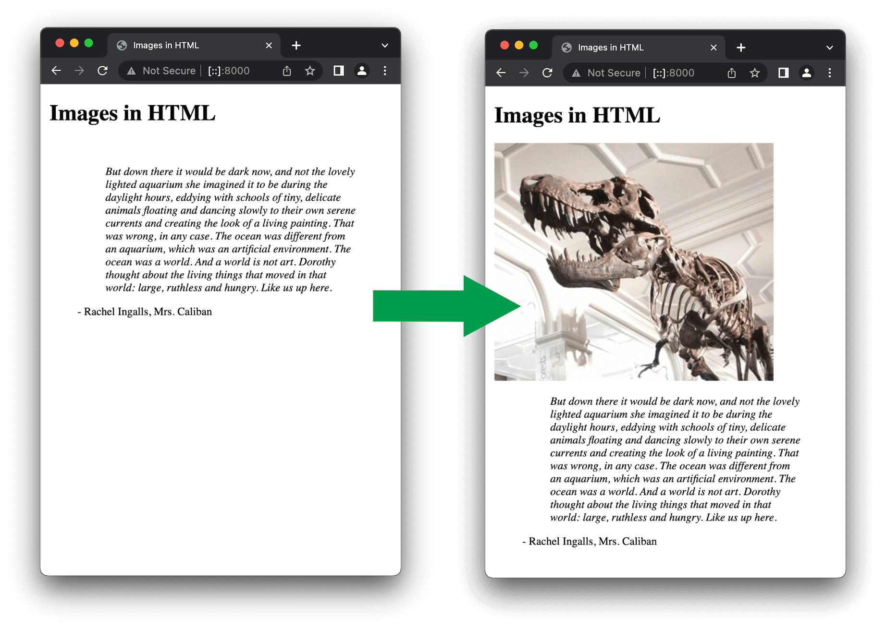
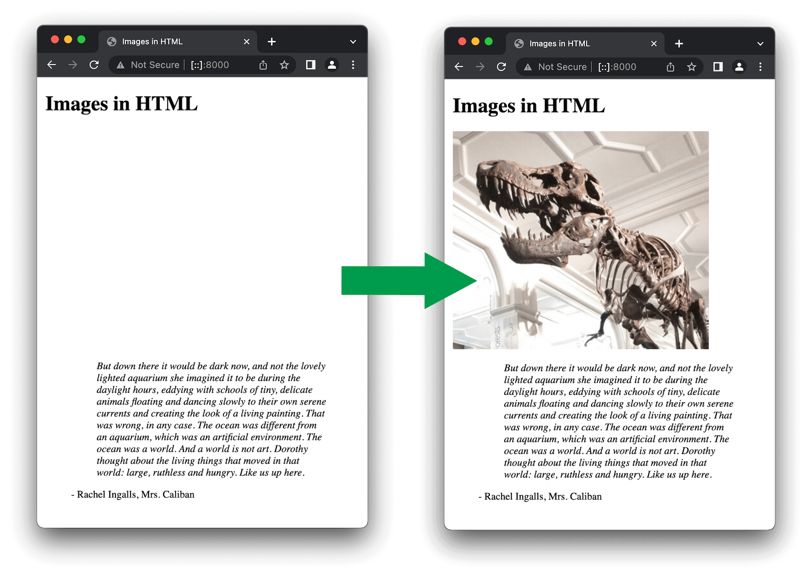

# img元素

在网页上放置简单的图像，需要使用 `` 元素。

这个元素是空元素（即无法包含任何子内容和结束标签），它需要两个属性才能起作用：src 和 alt。


如果图像在名为 images 的子目录中，该子目录位于与 HTML 页面相同的目录中，你可以这样嵌入它：

```html

```


使用图像的绝对 URL 进行嵌入，例如：

```html

```


## 备选文本

alt属性：它的值应该是图片的文本描述，在图片无法显示或者因为网速慢而加载缓慢的情况下使用。

```html

```

测试 alt 文本的最简单方法是故意拼错文件名。如果我们的图片名字拼成 dinosooooor.jpg，浏览器就不会显示图片，而会显示 alt 文本：


## 正确的使用alt

- 如果图片仅用于装饰，你应该使用 CSS 背景图片，但如果必须使用 HTML，请添加空的 alt=""。
- 如果你的图片提供了重要的信息，就要在 `alt` 文本中**简要**的提供相同的信息，或者把这些信息写在主要的文本内容里，不要写冗余的备选文本，如果在主要文本中已经对图片进行了充分的描述，写 `alt=""` 就好。
- 如果你把图片嵌套在 `<a>` 标签里，来把图片变成链接，那你还必须提供无障碍的链接文本。在这种情况下，你可以写在同一个 `<a>` 元素里，或者写在图片的 alt 属性里，随你喜欢。


## 宽度和高度

width 和 height 属性来指定图片的宽度和高度，它们的值以像素为单位。

```html

```


页面的 HTML 和图片是分开的资源，由浏览器用相互独立的 HTTP(S) 请求来获取。一旦浏览器接收到 HTML，它就会开始将其显示给用户。

如果图片尚未接收到，那么浏览器将只渲染 HTML，并在图片接收到后立即更新页面。




在 HTML 中使用 `width` 和 `height` 属性来指定图片的实际大小，那么在下载图片之前，浏览器就知道需要为其留出多少空间。




HTML 属性不应该使用来调整图片的大小，图片大小过大，你的图片将看起来粗糙、模糊或太小，不仅浪费带宽而且图片还不符合用户需求。

如果**长宽比**不正确，图片也可能会变形。在将图片放到网页上之前，你应**使用图像编辑器将其设置为正确的大小**。

如果确实需要更改图片的大小，应该使用 **CSS** 来实现。


## title属性

给图片增加 `title` 属性来提供更多的信息，这会给我们一个鼠标悬停提示：

```html

```


`title` 有很多无障碍问题，尽量不要使用它。


## 语义容器

HTML 的 `<figure>` 和 `<figcaption>` 元素，为图片提供一个语义容器，在说明文字和图片之间建立清晰的关联：

```html
<figure>
   元素告诉浏览器和辅助技术工具，这段说明文字描述了 <figure> 元素的内容。

dinosaur skeleton;
            it has a large head with long sharp teeth"
    width="400"
    height="341" />

  <figcaption>
    A T-Rex on display in the Manchester University Museum.
  </figcaption>
</figure>
```

`<figcaption>` 元素告诉浏览器和辅助技术工具，这段说明文字描述了 `<figure>` 元素的内容。


从无障碍的角度来说，说明文字和 `alt` 文本扮演着不同的角色。

看得见图片的人们同样可以受益于说明文字，而 `alt` 文字只有在图片无法显示时才会发挥作用。

所以，说明文字和 alt 的内容不应该一样，因为当图片无法显示时，它们会同时出现。


figure 里不一定要是图片，只要是这样的独立内容单元即可：

- 用简洁、易懂的方式表达意图。
- 可以置于页面线性流的某处。
- 为主要内容提供重要的补充说明。


# 响应式图片

想要显示相同的图片内容，依据设备来决定显示得更大或更小的图片。

srcset 和 sizes：提供更多额外的资源图像和提示。

```html

```

- `srcset`属性定义了三个图像文件：`small.jpg`，`medium.jpg`和`large.jpg`。每个文件后面的数字（例如`500w`）表示该图像的宽度。这意味着`small.jpg`的宽度是500像素，`medium.jpg`的宽度是1000像素，`large.jpg`的宽度是2000像素。
- `sizes`属性定义了三个媒体条件。`(max-width: 600px) 500px`表示如果视口的最大宽度是600像素，那么图像的大小应该是500像素。`(max-width: 1200px) 1000px`表示如果视口的最大宽度是1200像素，那么图像的大小应该是1000像素。`2000px`表示在其他所有情况下，图像的大小应该是2000像素。
- `src`属性是一个后备选项，用于在浏览器不支持`srcset`和`sizes`属性时显示图像。


例如，如果设备的视口宽度是800像素，并且设备的像素密度是2，那么浏览器会选择`medium.jpg`，因为它的宽度（1000像素）最接近视口宽度（800像素）乘以像素密度（2）的结果（1600像素）。


## picture

`<picture>`元素使用：

```html
<picture>
  <source media="(max-width: 799px)" srcset="elva-480w-close-portrait.jpg">
  <source media="(min-width: 800px)" srcset="elva-800w.jpg">
  
</picture>
```

在这个示例中：

- `<picture>`元素包含了一些`<source>`元素和一个``元素。
- 每个`<source>`元素都有一个`media`属性，它包含一个媒体条件。这些条件决定哪张图片会显示。例如，如果视窗的宽度为799px或更少，第一个`<source>`元素的图片就会显示。如果视窗的宽度是800px或更大，就显示第二张图片。
- `srcset`属性包含要显示图片的路径。`<source>`元素可以使用`srcset`属性引用多个图像，还有`sizes`属性。所以你可以通过一个`<picture>`元素提供多个图片，也可以给每个图片提供多分辨率的图片。
- 在任何情况下，你都必须在`</picture>`之前正确提供一个``元素以及它的`src`和`alt`属性，否则不会有图片显示。当媒体条件都不返回真的时候，它会显示默认图片；如果浏览器不支持`<picture>`元素时，它可以作为后备方案。