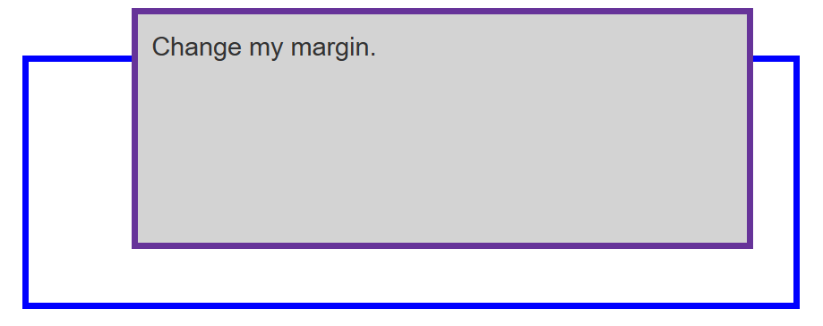

# 盒模型

# 区块盒子与行内盒子

在 CSS 中，我们有几种类型的盒子，一般分为**区块盒子**（block boxes）和**行内盒子**（inline boxes）。

类型指的是盒子在页面流中的行为方式以及与页面上其他盒子的关系。盒子有**内部显示**（inner display type）和**外部显示**（outer display type）两种类型。


## 外部显示

### block

- 盒子会产生换行。
- **width** 和 **height** 属性可以发挥作用。
- 内边距、外边距和边框会将其他元素从当前盒子周围“推开”。
- 如果未指定 **width**，方框将沿行向扩展，以填充其容器中的可用空间。在大多数情况下，盒子会变得与其容器一样宽，占据可用空间的 100%。

某些 HTML 元素，如 `<h1>` 和 `<p>`，默认使用 `block` 作为外部显示类型。


### inline

- 盒子不会产生换行。
- **width** 和 **height** 属性将不起作用。
- 垂直方向的内边距、外边距以及边框**会被应用**但是**不会把其他处于 `inline` 状态的盒子**推开（可能会导致**内容重叠**）。
- 水平方向的内边距、外边距以及边框**会被应用**且**会把**其他处于 `inline` 状态的盒子推开。

某些 HTML 元素，如 `<a>`、 `<span>`、 `<em>` 以及 `<strong>`，默认使用 `inline` 作为外部显示类型。


## 内部显示

区块和行内布局是网络上的默认行为方式。默认情况下，在没有任何其他指令的情况下，**方框内的元素也会以标准流的方式布局**，并表现为区块或行内盒子。


例如，可以通过设置 `display: flex;` 来更改内部显示类型。该元素仍将使用外部显示类型 `block` 但内部显示类型将变为 `flex`。


# 盒模型

CSS 中组成一个区块盒子需要：

- 内容盒子：显示内容的区域；使用 **inline-size** 和 **block-size** 或 **width** 和 **height** 等属性确定其大小。
- 内边距盒子：填充位于内容周围的空白处；使用 **padding** 和相关属性确定其大小。
- 边框盒子：边框盒子包住内容和任何填充；使用 **border** 和相关属性确定其大小。
- 外边距盒子：外边距是最外层，其包裹内容、内边距和边框，作为该盒子与其他元素之间的空白；使用 **margin** 和相关属性确定其大小。


总宽度：（左/右）外边框 + （左/右）边框 + （左/右）内边距 + 内容宽度

总高度：（上/下）外边框 + （上/下）边框 + （上/下）内边距 + 内容高度


## 代替盒模型

在替代盒模型中，任何宽度都是页面上可见方框的宽度。

内容区域的宽度是该宽度减去填充和边框的宽度。

```css
.box {
  box-sizing: border-box;
  width: 350px;
  height: 150px;
  margin: 10px;
  padding: 25px;
  border: 5px solid black;
}
```


内容宽度 = width - border * 2 - padding * 2


# 外边距

外边距是盒子周围一圈看不到的空间。它会把其他元素退推离盒子。

外边距属性值可以为正也可以为负。在盒子一侧**设置负值会导致**盒子和页面上的其他**内容重叠**。

```css
.box {
  margin-top: -40px;
  margin-right: 30px;
  margin-bottom: 40px;
  margin-left: 4em;
}
```




## 外边距折叠

根据外边距相接触的两个元素是正边距还是负边距，结果会有所不同：

- 两个正外边距将合并为一个外边距。其大小等于最大的单个外边距。
- 两个负外边距会折叠，并使用最小（离零最远）的值。
- 如果其中一个外边距为负值，其值将从总值中减去。

例如：

1. 一段的 `margin-bottom` 为 50 像素，另一段的 `margin-top` 为 30 像素。页边距折叠在一起，因此方框之间的实际页边距是 50 像素，而不是两个页边距的总和。

2. 第一个段落 margin-bottom 设置的 50 像素，第 2 段的 margin-top 设置为 -10，总边距变成了 40px（从 50px 中减去该负值）。


# 边框
边框是在边距和填充盒子之间绘制的。

如果你正在使用**标准的盒模型**，边框的大小将添加到框的宽度和高度。

如果你使用的是**替代盒模型**，边框越大会使内容框越小，因为它会占用一些可用的宽度和高度。


边框有样式、宽度和颜色：

```css
.box {
  border: 1px solid blue;
}
```

将四个（上下左右）边框设置为，大小1像素，实心，蓝色。


欲分别设置每边的属性，可以使用：

- border-top

- border-right
- border-bottom
- border-left

欲设置所有边的宽度、样式或颜色，可以使用：

- border-width

- border-style
- border-color

欲设置单条边的宽度、样式或颜色，可以使用最细粒度的普通属性之一：

- border-top-width
- border-top-style
- border-top-color
- border-right-width
- border-right-style
- border-right-color
- border-bottom-width
- border-bottom-style
- border-bottom-color
- border-left-width
- border-left-style
- border-left-color


# 内边距

内边距位于边框和内容区域之间，用于将内容推离边框。内边距不能为负数。

任何应用于元素的背景都会显示在内边距后面。如果你给元素设置了背景色或背景图片，那么这个背景不仅仅会覆盖元素的内容区域，还会覆盖到元素的内边距区域。


padding 简写属性一次性控制元素所有边，或者每边单独使用等价的普通属性：

- padding-top
- padding-right
- padding-bottom
- padding-left


```css
.box {
  padding-top: 0;
  padding-right: 30px;
  padding-bottom: 40px;
  padding-left: 4em;
}

.container {
  padding: 20px;
}
```

```html
<div class="container">
  <div class="box">Change my padding.</div>
</div>
```

显示效果：


# 背景与边框

## 背景颜色

background-color 属性定义了 CSS 中任何元素的背景颜色。属性接受任何有效的 `<color>` 值。

background-color 可以延伸至元素的**内容**和**内边距**盒子的下面。


```css
.box {
  background-color: blue;
}
```


## 背景图像

background-image 属性可以在一个元素的背景中显示一个图像。

默认情况下，大图不会缩小以适应盒子，因此我们只能看到它的一个小角，而小图则是平铺以填充方框。


```css
.b {
  background-image: url(star.png);
}
```


## 背景平铺

background-repeat 属性用于控制图像的平铺行为：

- `no-repeat`——阻止背景重复平铺。
- `repeat-x`——仅水平方向上重复平铺。
- `repeat-y`——仅垂直方向上重复平铺。
- `repeat`——默认值，在水平和垂直两个方向重复平铺。


## 图像大小

 background-size 属性，它可以设置长度或百分比值：

- `cover`：浏览器将使图像足够大，使它完全覆盖了盒子区域，同时仍然保持其宽高比。在这种情况下，图像的部分区域可能会跳出盒子外。
- `contain`：浏览器会将图像调整到适合框内的尺寸。在这种情况下，如果图像的长宽比与盒子的长宽比不同，你可能会在图像的两边或顶部和底部出现空隙。


## 图像定位

background-position 属性允许你选择背景图片出现在它所应用的盒子上的位置。

这使用了一个坐标系统，其中方框的左上角是 (0,0)（默认值），方框沿水平（x）和垂直（y）轴定位。


可以使用 `top` 和 `right` 这样的关键字、长度、百分比：

```css
.box1 {
  background-image: url(star.png);
  background-repeat: no-repeat;
  background-position: 20px top;
}

.box2 {
  background-image: url(star.png);
  background-repeat: no-repeat;
  background-position: 20px 30%;
}
```


 background-position 是 background-position-x 和 background-position-y 的简写.


## 多个图像背景

在单个属性值中指定多个 `background-image` 值，用逗号分隔每个值，背景将分层，最后列出的背景图片位于最下层。

其他 `background-*` 属性也可以像 `background-image` 一样使用逗号分隔的方式设置：

```css
background-image: url(image1.png), url(image2.png), url(image3.png),
  url(image4.png);
background-repeat: no-repeat, repeat-x, repeat;
background-position:
  10px 20px,
  top right;
```

当不同的属性具有不同数量的值时，较小数量的值会循环。


## 背景附加

background-attachment 属性控制指定内容滚动时的滚动方式：

- `scroll`：它会**随着页面的滚动而滚动**。
- `fixed`：它将始终保持在**屏幕上相同的位置**。
- `local`：它将始终固定在**元素相同的位置**。


## 属性简写

```css
body {
    background: #ffffff url("tree.png") no-repeat right top;
}
```

- `background-color`: #ffffff
- `background-image`: url(“tree.png”)
- `background-repeat`: no-repeat
- `background-position`: right top


# 精灵图

所谓精灵图就是**图片拼合技术**，它就是把多张小图合成一张大图，通过css中的background-position属性，显示精灵图中某一个小图标。


```css
#three div[class="img"]{
    display: inline-block;
    /* 盒子的宽度和高度 与 精灵图框选部分 一致*/
    width: 65px;
    height: 72px;
    
    background-image: url("../img/tb.jpg");
    /* 分别对应 x 和 y轴 */
    background-position: -4px -134px;
    
    /* 背景不平铺 */
    background-repeat: no-repeat;
}
```

