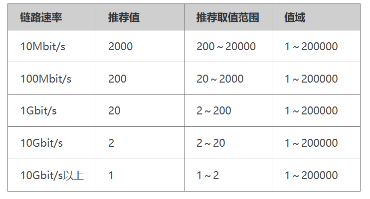
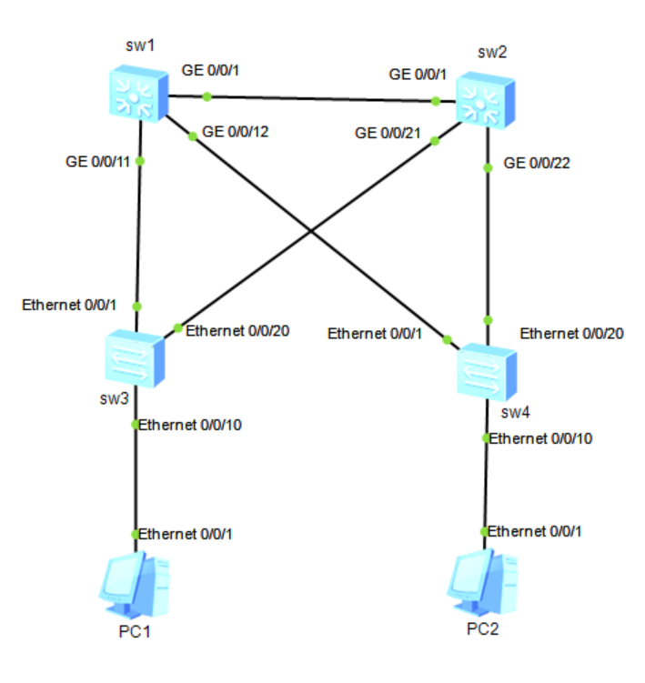

# STP

STP可以将有环路的物理拓扑变成无环路的逻辑拓扑，以避免环路产生或链路断开。

STP使网络中的计算机在通讯时只有一条链路，当链路出现故障时，重新计算出新的最优链路，从而保证网络连接稳定可靠。


## 简单术语

1. **桥**：泛指具有任意多个端口的交换机。
2. **桥的MAC地址**：一台交换机有多个端口，每个端口都有一个MAC地址。
3. **桥ID（BID）**：由两部分组成，前两个字节为这个桥设置的优先级，后面6个字节是这个桥的MAC地址。
4. **端口ID（PID）**：具有多种组成方式，常见的方式为以下两种：
    1. **第一种**：端口ID由2字节组成，**字节1**是该端口ID的**优先级**，**字节2**是该端口的**端口号**。
    2. **第二种**：端口ID由2字节（16位）组成，**前4位**是该端口的端口**优先级**，**后12位**是该端口的**端口号**。
5. **根路径开销（RPC）**：某个**交换机（某个端口）到根桥的累积路径开销**。即从该端口到根桥所经过的所有链路的路径开销总和。
6. **根桥**：整个交换网络的逻辑中心（不一定是物理中心）

6. **根端口**：非根桥可能由多个端口与根桥通信，非根桥到根桥通信最优的端口（根端口）。

7. **指定端口**：向下层交换机转发数据的端口。

8. **阻塞端口**：被阻塞用于备用的端口，该端口**不转发数据帧**（不接受、不发送），但可以**接收并处理STP帧**（仅接受，不发送）。


注：根端口和指定端口转发数据帧（接收和发送），阻塞端口不转发数据帧（不接收，不发送）。


## 生成树


### 1. 根桥选举

STP启动后，所有交换机会认为自己是根桥，并在发送给其他交换机的BPDU中宣告自己是根桥。

当交换机从网络中收到其他设备发送过来的BPDU的时候，会比较新的BPDU中的根桥BID和自己的BID，较小的BID将作为根桥。交换机会将新的BPDU的时候，会宣告新的根桥。

交换机会互相交换BPDU，最后BID最小的根桥会成为根桥。


### 2. 根端口选举

根端口是非根桥（交换机）某个端口到根桥（交换机）通信的最优端口。即从该端口到根桥的路径开销总和最小的端口。

根桥没有根端口，根桥的所有端口均为指定端口。

非根桥会选举唯一一个根端口，到根桥路径开销总和最小的端口。


### 3. 其他端口

根桥交换机只有指定端口，不会有除了指定端口以外的其他任何端口。


在**非根桥**的交换机中，除了根端口以外的端口，可称之为其他端口或非根端口。

其他端口分为：指定端口和阻塞端口。

在生成树协议（STP）中，非根桥的其他端口通过**比较收到的RPC**和**自身该端口的RPC**来确定（是指定端口，还是阻塞端口）。

**指定端口**：**（非根桥）其他端口**收到BPDU中的**RPC大于自身该端口的RPC**，则该端口为**指定端口**。

**阻塞端口**：**（非根桥）其他端口**收到BPDU中的**RPC小于自身该端口的RPC**，则该端口为**阻塞端口**。


# 华为生成树


## 1. 配置工作模式

设备支持STP、RSTP和MSTP三种生成树工作模式。默认情况MSTP模式。

**system-view**，进入系统视图。

配置交换设备的生成树工作模式。

```
stp mode { stp | rstp | mstp}
```


## 2. 配置根桥和备份根桥

在一棵生成树中，生效的根桥只有一个；同一个网络中，多个设备的BID相同时，系统将选择MAC地址最小的设备作为根桥。

如果配置了多个根桥，则MAC地址最小的根桥将成为根桥。


当根桥出现故障或被关机时，备份根桥可以取代根桥成为指定生成树的根桥。

此时若配置了新的根桥，则备份根桥将不会成为根桥。

如果配置了多个备份根桥，则MAC地址最小的备份根桥将成为指定生成树的根桥。


### 2.1 根桥

执行命令**system-view**，进入系统视图。

配置当前设备为根桥设备。

```
stp root primary
```

注意：配置后该设备优先级BID值自动为0，并且不能更改设备优先级。


### 2.2 备份根桥

配置当前交换设备为备份根桥设备。

```
stp root secondary
```

注意：配置后该设备优先级BID值为4096，并且不能更改设备优先级。


### 2.3 取消根桥或备份根桥

取消根交换设备或者备份根交换。

```
undo stp root
```


## 3. 配置设备优先级

在一个运行STP/RSTP的网络中，只有一个根桥。

一般会选择性能高，网络层次高的作为根桥。

但是，性能高、网络层次高的交换设备其优先级不一定高，因此需要配置优先级以保证该设备成为根桥。


执行命令**system-view**，进入系统视图。

配置交换设备在系统中的优先级。

缺省情况下，交换设备的优先级取值是32768。

```
stp priority [value]
```

如当前设备为根桥设备或备份根桥设备，则无法改变当前设备的优先级。

如果需要改变优先级，必须先通过**undo stp root**命令关闭。


## 4. 端口路径开销


路径开销是STP/RSTP协议用于选择链路的参考值。

端口路径开销值取值范围由路径开销计算方法决定。

如果端口所处链路的速率值越大，则建议将该端口的路径开销值在指定范围内设置越小。


端口所对应的链路速率与端口路径开销值对应表




路径开销的计算方法有三种：

- **dot1d-1998**：表示按照IEEE 802.1d-1998标准来计算缺省路径开销。
- **dot1t（默认）**：表示按照IEEE 802.1t标准来计算缺省路径开销。
- **legacy**：表示按照华为的计算方法来计算缺省路径开销。


### 4.1 配置路径开销计算方法

执行命令**system-view**，进入系统视图。

配置路径开销的计算方法

```
stp pathcost-standard { dot1d-1998 | dot1t | legacy }
```


### 4.2 设置端口的路径开销值

配置当前端口的路径开销值

进入一个指定的端口

```
interface interface-type interface-number
```


设置当前端口的路径开销值

```
stp cost [value]
```

- 使用华为计算方法时参数*cost*取值范围是1～200000。
- 使用IEEE 802.1d标准方法时取值范围是1～65535。
- 使用IEEE 802.1t标准方法时取值范围是1～200000000。


## 5. 端口优先级

当两个端口的路径开销总和相同时，其（端口）优先级的高低会影响到是否被选举为指定端口。


执行命令**system-view**，进入系统视图。

进入一个指定的端口

```
interface interface-type interface-number
```

配置端口的优先级

```
stp port priority [value]
```

缺省情况下，交换设备端口的优先级取值是128。


# 生成树案例（华为）


拓扑图：

SW1和SW2为核心交换机。

其中将SW1配置为根交换机，SW2为备用根交换机


SW3和SW4作为接入交换机。

SW1-SW3及SW1-SW4的链路由主链路。

SW2-SW3及SW2-SW4的链路作为备用链路。




## sw1配置

设置模式为stp


设置为根桥


创建vlan10**（一定要创建，如果设置trunk允许vlan10通过，但是该交换机上没有创建vlan10，一样不能通过）**

**（一定要创建，血的教训）**

**（一定要创建，血的教训）**

**（一定要创建，血的教训）**

**（一定要创建，血的教训）**

**（一定要创建，血的教训）**

**（一定要创建，血的教训）**


创建临时端口组，将所有端口都加入


将所有端口设置为trunk模式


设置所有端口的trunk模式允许所有vlan通过


## sw2配置

设置模式为stp


设置为备用根桥


创建vlan10


创建临时端口组，将所有端口都加入


将所有端口设置为trunk模式


将所有端口的trunk模式设置为允许所有vlan通过


## sw3配置

设置模式为stp


创建vlan10


进入端口10，设置为access模式，设置vlan为vlan10


除了端口10，其他端口加入端口组


设置所有端口为trunk


设置trunk允许所有vlan通过


## sw4配置

设置模式为stp


创建vlna10


进入10端口，设置为access模式，设置vlan为10


将端口10以外的端口，加入临时端口组


设置为trunk模式


设置trunk允许所有vlan通过


